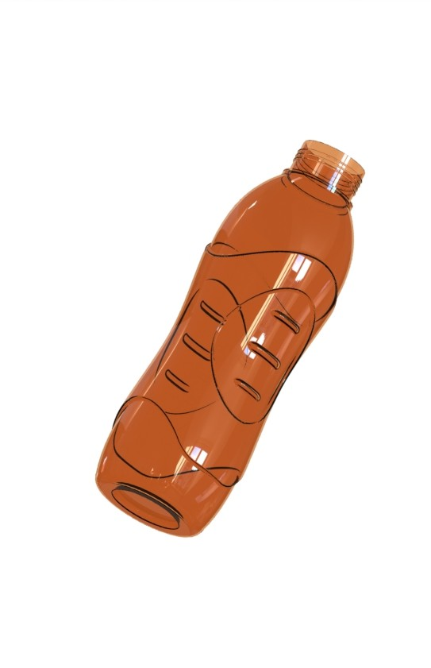

# Consumer Product Design Collection

## 📌 Project Overview
This repository showcases high-quality consumer product designs modeled in SolidWorks. The focus is on combining functional mechanical engineering with aesthetic product design and complex geometric patterning.

---

## 1️⃣ Ergonomic Water Bottle (Assembly Design)
This project demonstrates the design of a multi-component product, focusing on material transparency, assembly mates, and ergonomic grips.

### 🛠 Technical Highlights:
- **Assembly Management:** Created mates between the bottle body and the threaded cap.
- **Body Design:** Modeled ergonomic indents for a better grip using advanced surfacing.
- **Transparency & Rendering:** Applied realistic shaders to visualize liquid and amber-tinted plastic.

### 📸 Visualization Gallery:
| 1. Full Assembly | 2. Bottle Body | 3. Cap Detail (Top View) |
| :---: | :---: | :---: |
|  |  |  |

*(Note: If images are not visible, please check the Renders folder for exact filenames and extensions.)*

---

## 2️⃣ Badminton Shuttlecock (Complex Patterning)
A high-fidelity model emphasizing repetitive geometric accuracy and component assembly.

### 🛠 Technical Highlights:
- **Advanced Patterning:** Utilized complex **Circular Patterns** for the feather structure.
- **Component Mating:** Precise assembly of the cork base and individual feathers.

### 📸 Visuals:

---

## 🛠 Skills & Tools Demonstrated
- **Software:** SolidWorks 2019
- **Competencies:** Assembly Mates, Surfacing, Circular Patterns.
- **Visualization:** Photorealistic rendering (KeyShot).

## 📂 Project Structure
- `CAD_Files/`: Original SolidWorks files and Assemblies.
- `Renders/`: High-resolution visualizations.

---
*Developed as part of my Mechanical Engineering Design Portfolio.*