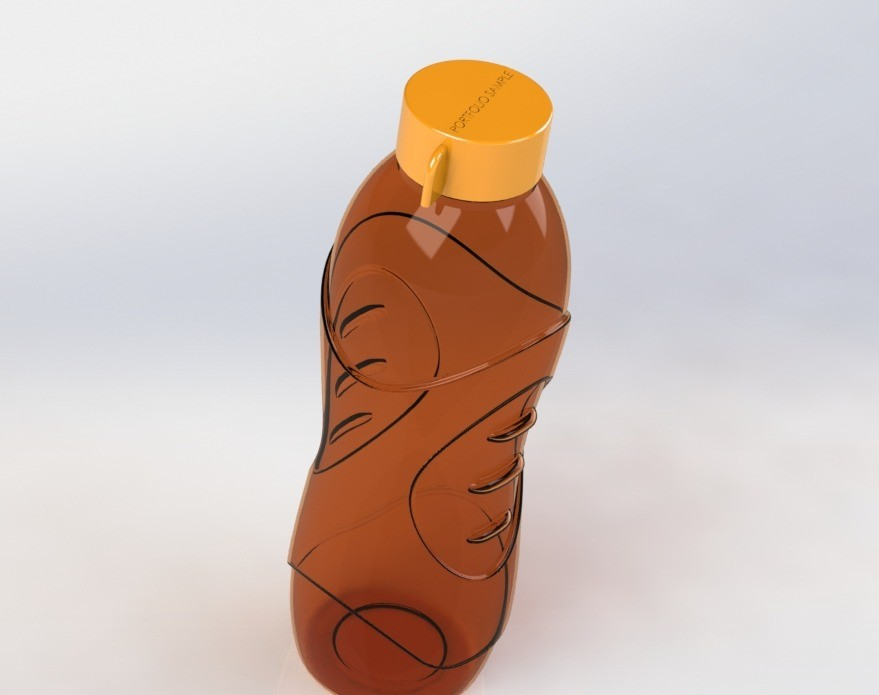
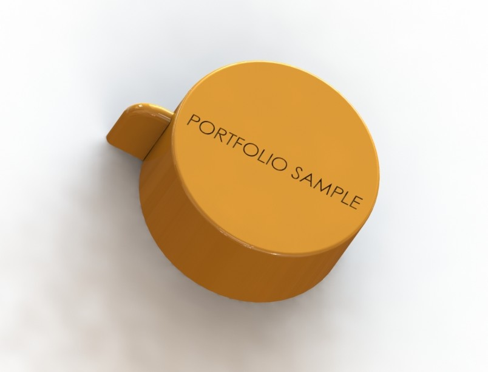
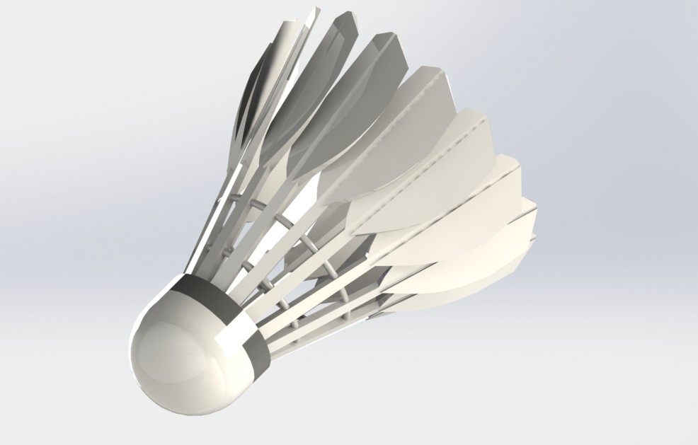

# Consumer Product Design Collection

## 📌 Project Overview
This repository showcases high-quality consumer product designs modeled in SolidWorks. The focus is on combining functional mechanical engineering with aesthetic product design, ergonomic considerations, and complex geometric patterning.

---

## 1️⃣ Ergonomic Water Bottle (Assembly Design)
A detailed design of a portable water bottle featuring an ergonomic grip and a functional cap assembly.

### 🛠 Technical Highlights:
- **Assembly Management:** Created a multi-part system including the bottle body and its threaded cap.
- **Ergonomic modeling:** Designed custom finger indents and grip patterns for comfort and functionality.
- **Material Visualization:** Applied realistic amber-tinted transparency and plastic shaders to showcase material finish.

### 📸 Visuals:
| Front View | Top View (Cap Detail) |
| :---: | :---: |
|  |   |   |

---

## 2️⃣ Badminton Shuttlecock (Complex Patterning)
A high-fidelity model of a badminton shuttlecock, emphasizing repetitive geometric accuracy.

### 🛠 Technical Highlights:
- **Advanced Patterning:** Utilized complex **Circular Patterns** for the feather structure.
- **Component Mating:** Precise assembly of the cork base and individual feather components.

### 📸 Visuals:

---

## 🛠 Skills & Tools Demonstrated
- **Software:** SolidWorks 2019
- **Competencies:** Assembly Mates, Advanced Surfacing, Circular Patterns.
- **Visualization:** Photorealistic rendering (KeyShot).

## 📂 Folder Structure
- `CAD_Files/`: Original SolidWorks files and Assemblies.
- `Renders/`: High-resolution visualizations.

---
*Developed as part of my Mechanical Engineering Design Portfolio.*